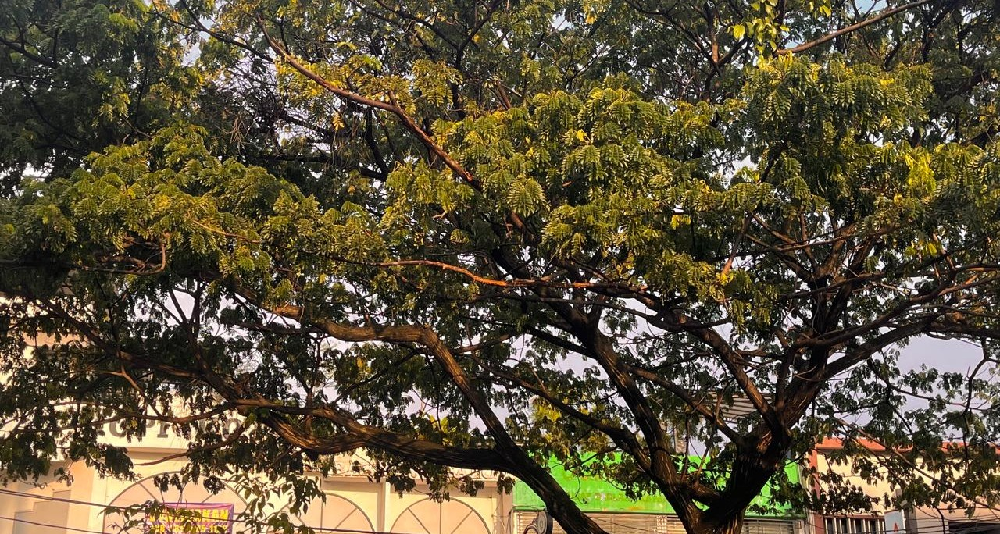

 

"The Sun is Nice", I said, as the three of us steps out to a small porch in front of our office. A moment earlier, I captured the moment of the tree and the sun dissolving into each other. I pull my mini-phone and take a picture swiftly. Lou notices and asked me about it. "The Sun is Nice", I said in response. They didn't seem to be against that remark. The sun was, indeed, really nice.

A small moment like this somehow stay with me. Being able to express an appreciation to our surroundings and transform it into a collective, voluntary experience, feels very significant. I can't really see through their face, but I'm convinced that they shifted a bit.

Depok greeted me warm today - after my visit to Bandung last weekend. My steps are back in rhythm, my pace is great, and all the energies are on the right frequency. I announce that today, I am so back! At least until the next (inevitable) disturbance come.